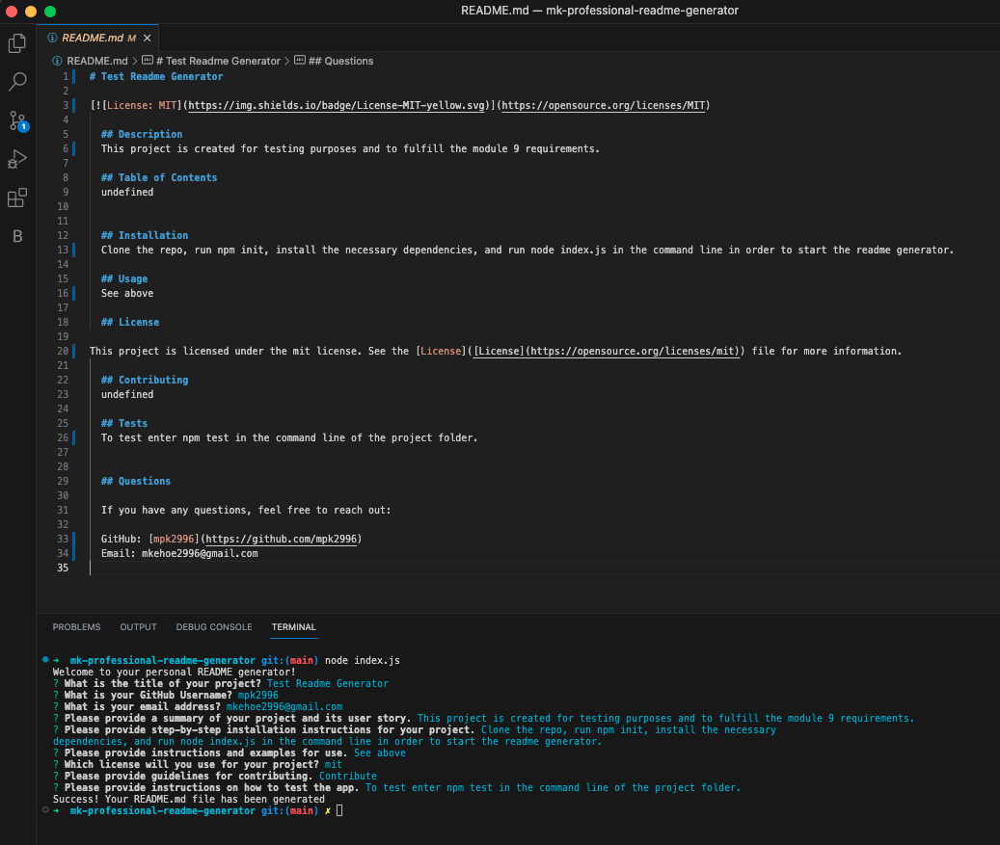

# 09 Node.js Challenge: Professional README Generator

## Description
This README generator is a command-line application that accepts user input to prompts that help fulfill the categories necessary to create a quality README for the user's project.

## Visuals

https://drive.google.com/file/d/136SZAjh0yEW6Gijh2mDfoYsxMwMI7EFe/view

## Installation
To install this application, you will need to clone the repository from GitHub.
git clone
https://github.com/m9861036/readme-generator.git

## Contributing
To contribute to this project, create a pull request using the following steps:
- Fork the repo
- Create a feature branch (git checkout -b BRANCH-NAME)
- Commit your changes (git commit -m "Added x feature")
- Push to the branch (git push origin BRANCH-NAME)
- Create a new Pull Request

## License
MIT License

## Contact Information:
GitHub Username: mpk2996

GitHub Profile: https://github.com/mpk2996
